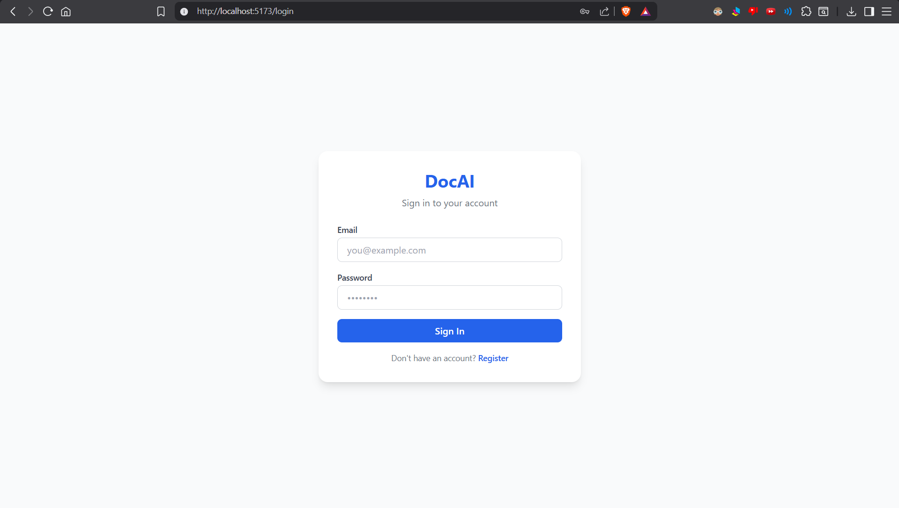
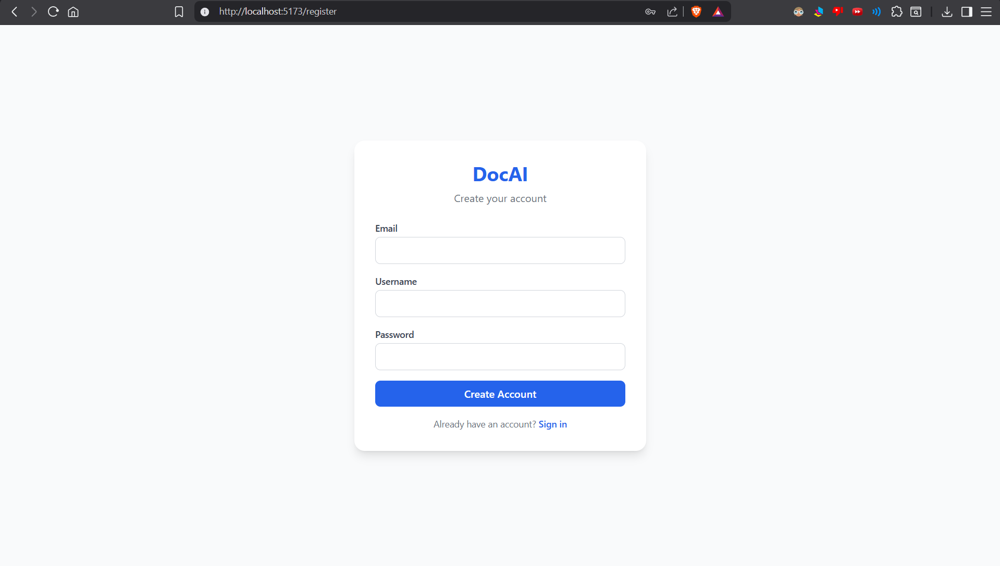
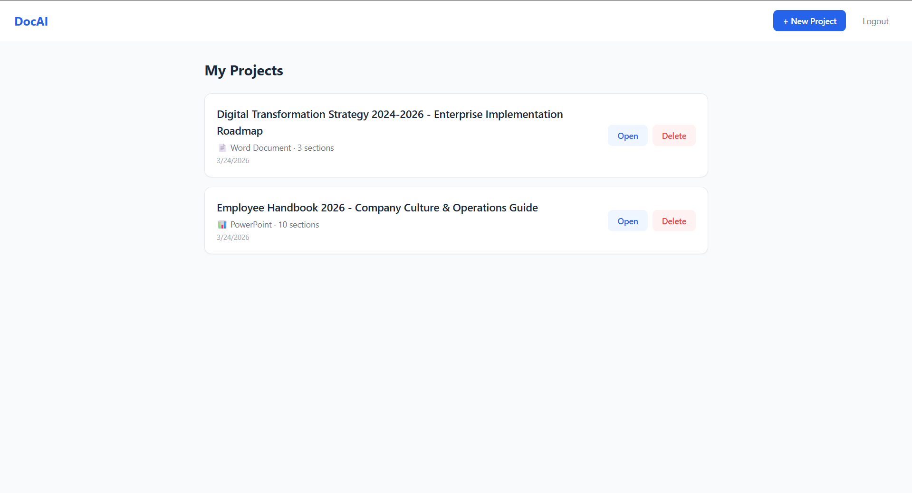
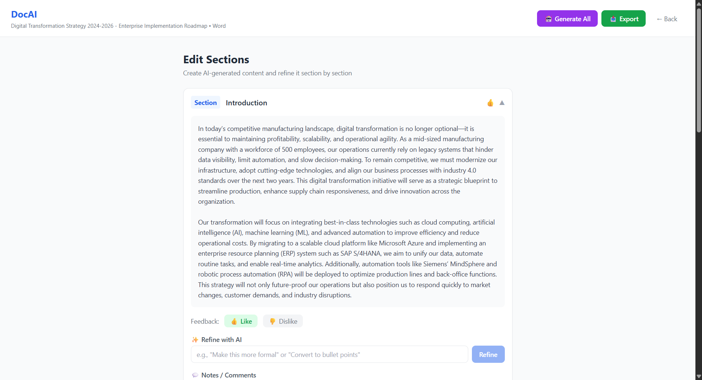

# 📄 DocAI - AI Document Platform

## Overview

**DocAI** is an intelligent document generation platform that uses artificial intelligence to automatically create professional business documents and presentations. Instead of spending hours writing documents from scratch, simply describe what you need, and our AI generates complete, ready-to-use documents in minutes.

Whether you're creating a product launch strategy, digital transformation roadmap, or employee handbook, DocAI handles the heavy lifting while you focus on what matters most.

---

## ✨ What Makes DocAI Special?

- **AI-Powered Writing**: Generates professional content in seconds
- **Multiple Formats**: Export as Word documents (.docx) or PowerPoint presentations (.pptx)
- **Editable Sections**: Refine and customize each section to your needs
- **Fast & Free**: Uses free-tier AI models with no credit card required
- **User-Friendly**: No technical skills needed - anyone can use it

---

## 🤖 AI Models Used

### **Groq - Llama 3.2 90B Vision Preview**
- **What it does**: Understands your project description and generates high-quality, professional content
- **Why we chose it**: Ultra-fast responses, completely free with generous rate limits (500+ requests/minute)
- **Quality**: Enterprise-grade language model trained on billions of documents
- **Cost**: ✅ FREE with no paid tier required

### **How it works**:
1. You describe what document you need
2. Groq's AI analyzes your request
3. Professional content is generated in seconds
4. You can refine and improve any section

---

## 🛠️ Technology Stack

### **Backend (Server)**
- **FastAPI** - Modern web framework for building fast APIs
- **Python 3.9+** - Programming language
- **SQLAlchemy** - Database management
- **SQLite** - Lightweight database for storing user data
- **Groq API** - AI content generation
- **JWT** - Secure user authentication

### **Frontend (User Interface)**
- **React 18** - JavaScript framework for responsive UI
- **Vite** - Lightning-fast development environment
- **Tailwind CSS** - Beautiful, modern styling
- **Axios** - Communication with the backend
- **React Router** - Navigation between pages

### **Deployment & Tools**
- **Uvicorn** - Server for running the backend
- **npm** - Package manager for frontend
- **Git** - Version control

**In Simple Terms**: The backend (server) handles the AI magic and data storage. The frontend is what you see and interact with in your browser.

---

## 📁 Project File Structure

```
ai-doc-platform/
├── backend/                      # Server-side code
│   ├── main.py                   # Application start
│   ├── auth.py                   # User login/security
│   ├── database.py               # Database setup
│   ├── models.py                 # Data structure definitions
│   ├── schemas.py                # Input validation
│   ├── requirements.txt           # Python dependencies
│   ├── .env                       # Configuration (API keys)
│   ├── routes/                    # API endpoints
│   │   ├── auth_routes.py        # Login/Register
│   │   ├── project_routes.py     # Project management
│   │   ├── ai_routes.py          # Content generation
│   │   └── export_routes.py      # Document export
│   └── services/                  # Business logic
│       ├── ai_service.py         # AI API integration
│       ├── docx_service.py       # Word document creation
│       └── pptx_service.py       # PowerPoint creation
│
├── frontend/                     # User interface code
│   ├── src/
│   │   ├── main.jsx             # Application entry
│   │   ├── App.jsx              # Main app component
│   │   ├── api.js               # Backend communication
│   │   ├── pages/               # Different screens
│   │   │   ├── LoginPage.jsx
│   │   │   ├── RegisterPage.jsx
│   │   │   ├── DashboardPage.jsx
│   │   │   ├── ConfigurePage.jsx
│   │   │   └── EditorPage.jsx
│   │   ├── components/          # Reusable UI pieces
│   │   │   └── SectionCard.jsx
│   │   ├── context/             # User data management
│   │   │   └── AuthContext.jsx
│   │   └── index.css            # Styling
│   ├── package.json             # JavaScript dependencies
│   └── vite.config.js           # Build configuration
│
├── Demo_Photos/                 # Screenshot images
├── Demo_Videos/                 # Demo video
└── README.md                    # This file
```

---

## 🎯 Key Features & How to Use

### **1. User Authentication**
- Create a secure account
- Login with email and password
- Your documents are private and encrypted

### **2. Create a Project**
- Give your document a title
- Provide a detailed description of what you need
- Choose output format (Word or PowerPoint)
- Set the number of sections

### **3. AI-Powered Generation**
- Click "Generate All" to create content
- The AI writes professional sections automatically
- Takes just 30-60 seconds per document

### **4. Edit & Refine**
- Review each section
- Use "Refine with AI" to improve specific parts
- Add notes and comments
- Save your changes

### **5. Export**
- Download as Word document (.docx)
- Download as PowerPoint presentation (.pptx)
- Share with colleagues or clients

---

## 📸 Platform Screenshots

### **Login Page**

*Create your account or log in to access your documents. Your account keeps all your projects organized and secure.*

### **Register Page**

*Sign up in seconds with just an email and password. No credit card required!*

### **Dashboard**

*Your project hub. See all your documents, create new ones, and manage your work. Each project is tracked with creation dates and document types.*

### **Editor**

*The heart of DocAI. Generate, view, edit, and refine each section of your document. Use AI refinement to customize content exactly how you want it.*

---

## 💡 Real-World Use Cases

### **1. Business Strategy Documents**
**Use Case**: Digital Transformation Roadmap
- **Challenge**: A manufacturing company needs to create a detailed 2-year transformation strategy but lacks the writing resources
- **Solution**: DocAI generates comprehensive strategy documents with implementation timelines, budgets, and risk assessments
- **Time Saved**: 4-5 hours → 10 minutes
- **Benefit**: Professional documents ready for board presentations

### **2. Human Resources**
**Use Case**: Employee Handbook
- **Challenge**: Writing an employee handbook is time-consuming and requires HR expertise
- **Solution**: DocAI creates customized handbooks covering compensation, benefits, policies, and culture
- **Time Saved**: 20-30 hours → 15 minutes
- **Benefit**: Consistent policies, reduced confusion, happy employees

### **3. Product Launches**
**Use Case**: Launch Strategy Presentation
- **Challenge**: Product teams need polished presentations for stakeholders, marketing plans, and investor pitches
- **Solution**: DocAI generates market analysis, competitive positioning, and go-to-market strategies
- **Time Saved**: 8-10 hours → 20 minutes
- **Benefit**: Professional presentations that impress investors and stakeholders

### **4. Technical Documentation**
**Use Case**: Software Architecture Guide
- **Challenge**: Developers need to document system architecture but lack time
- **Solution**: DocAI creates detailed technical documentation with diagrams and explanations
- **Time Saved**: 6-8 hours → 10 minutes
- **Benefit**: Better onboarding, reduced knowledge silos

### **5. Consulting & Agency Work**
**Use Case**: Client Proposals and Reports
- **Challenge**: Consultants write dozens of similar proposals and reports
- **Solution**: DocAI generates customized proposals with client-specific analysis
- **Time Saved**: 3-4 hours per proposal → 5 minutes
- **Benefit**: More time for client relationships, higher profit margins

### **6. Academic & Research**
**Use Case**: Research Papers and Theses
- **Challenge**: Writing research papers requires extensive research and organization
- **Solution**: DocAI helps structure arguments and generate sections based on research notes
- **Time Saved**: 20-40 hours → 5-10 hours
- **Benefit**: Better organization, faster completion

---

## 🎬 Demo Video

Want to see DocAI in action? Watch our complete walkthrough:

[](https://drive.google.com/file/d/1J_3F6wcTb2Jw86-FfSYSZehbFZ0tKSSf/view?usp=sharing)

**What you'll see**:
- Creating a new project
- Watching AI generate sections in real-time
- Editing and refining content
- Exporting to Word and PowerPoint formats

---

## 🚀 Quick Start Guide

### **For Users (No Installation Needed)**
1. Visit [DocAI Website] (coming soon)
2. Sign up with your email
3. Create a project
4. Describe what you need
5. Download your document

### **For Developers (Installation Required)**

**Prerequisites**: Python 3.9+, Node.js 16+

#### **Backend Setup**
```bash
cd backend
python -m venv venv
venv\Scripts\activate  # On Windows
pip install -r requirements.txt
uvicorn main:app --reload
```

#### **Frontend Setup**
```bash
cd frontend
npm install
npm run dev
```

#### **Environment Setup**
Create `backend/.env`:
```
SECRET_KEY=your-secret-key
GROQ_API_KEY=your-groq-api-key  (Get free key at console.groq.com)
GROQ_MODEL=llama-3.2-90b-vision-preview
```

---

## 📊 Why Choose DocAI?

| Feature | DocAI | Traditional Writing | Hiring Writer |
|---------|-------|-------------------|----------------|
| **Time** | ⚡ Minutes | 📅 Hours/Days | 📅 Days/Weeks |
| **Cost** | 💰 Free | 💸 Software cost | 💸💸💸 Salary |
| **Quality** | ✅ Professional | ✅ Good | ✅ Excellent |
| **Availability** | 24/7 | 24/7 | 9-5 Only |
| **Customization** | ✅ Easy | ⚠️ Manual | ✅ Easy |
| **Scalability** | ✅ Unlimited | ⚠️ Limited | ❌ No |

---

## 🛡️ Security & Privacy

- **Encrypted Passwords**: All passwords use industry-standard encryption
- **Private Documents**: Your documents are only accessible to you
- **HTTPS**: Secure data transmission
- **No Tracking**: We don't sell or share your data
- **Regular Backups**: Your documents are safely stored

---

##  Acknowledgments

- **Groq** - For providing free, ultra-fast AI
- **FastAPI** - For the amazing web framework
- **React & Vite** - For the responsive frontend

---

## 🚀 Future Roadmap

- ☐ Team collaboration features
- ☐ Template library
- ☐ Multi-language support
- ☐ Image & chart generation
- ☐ Mobile app
- ☐ Desktop app
- ☐ Integration with Google Docs, Microsoft Teams
- ☐ Advanced analytics

---

## 🎉 Get Started Today!

Ready to transform how you create documents?

1. **Sign up** - Free account, no credit card
2. **Create a project** - Tell us what you need
3. **Get results** - Professional documents in minutes
4. **Export & share** - Use your document anywhere

**[Start Creating Now]** (coming soon)

---

<div align="center">

**Made with ❤️ to save you time and frustration**

[Visit Website](#) • [GitHub](#) • [Twitter](#) • [LinkedIn](#)

</div>
